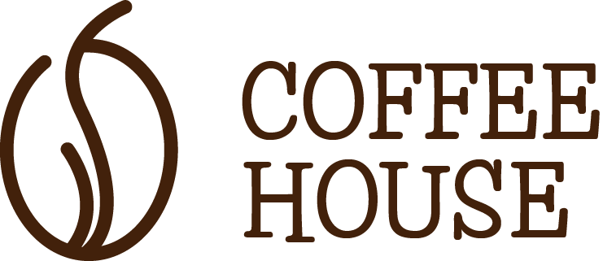
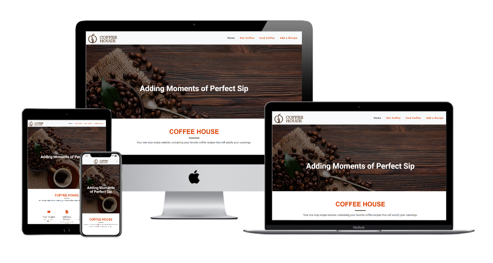

## Data Centric Milestone Project

Coffee House is my third Milestone Project that is a recipe online book which show different kinds of coffee recipes with 2 different categories. This project is allows users to create, read, update and delete. (CRUD)

Live site click [Here](https://coffee-recipes-ms3.herokuapp.com//)

## UX

__________________________________________________________________________________________________________________________________________________________________________________________________

### Goal of the Website

Is to provide coffee recipes where user can choose on 20 recipes and allows them to create or add their own coffee recipes which they can edit and delete anytime they want. This is a user-friendly website which the interface is easy to access and navigate.

__________________________________________________________________________________________________________________________________________________________________________________________________

### User stories

 As a user I want or I expect

- to use a online recipe book that is userfriendly which I can easily view the recipes
- to be able to see the recipe details clearly
- to be able to add my own recipe without complication
- to be able to edit the recipe that I will add
- to be able to delete the recipes.

## Wireframes

* [Wireframe-Mobile](readMeDocs/wireframes/Coffee-house-wireframe-mobile.pdf)
* [Wireframe-Desktop](readMeDocs/wireframes/Coffee-house-wireframe-desktop.pdf)

### Existing Features 

This website is a multiple website which consit of home page, categories pages and add a recipe page.

- Website logo
- Nabar, The navbar is fixed at the top of the page, this allows a user to easily navigate throughout the website. Which consist of Home, Hot coffee, Iced coffee and Add recipe tab.
- Home page - is the landing page where you can see the hero image of a coffee beans.
- Hot coffee tab - Where the 10 Hot coffee recipe is listed from the database and every recipe is clickable to view the whole recipe details.
- Iced coffee tab - Where the 10 Iced coffee recipe is listed from the database and every recipe is clickable to view the whole recipe details.
- Add Recipe tab - where the form is located to allow user to add their own recipe.
- Edit recipe button- allows the user to update information about the recipe. 
- Delete recipe button - allows to delete recipe from database which can not be undo.

### Features Left to Implement

There are a lot of features left to implement on this website to improve it more

- Sign up features - to allow users to create an account and log in using their chosen credentials.
- Search features - which one of important features to implement to allow the users to search easily the certain recipe that they looking for.
- Print the recipe button - which the user can print out the desire recipe they like.
- Sort the categories in each type (eg. If its late, caramel, cappucino kind of recipe) to allow the user to find easily the recipe they prefer.
- Put a Favourite tab, which allow the user to view the recipe they like the most easily.
- Rating feauture - to allow users to rate the recipes
- Share feauture - to allow users to share the recipe to their friends.

## Technologies used

- Gitpod : IDE used to build the website.
- [Heroku](https://heroku.com/) to host the project.
- [Github](https://github.com/) A remote repository used to store the source code for the project.
- [Balsamiq](https://balsamiq.com/): Wireframe builder application.
- [Bootstrap](https://getbootstrap.com/) : A framework to help you design websites faster and easier
- [Google Fonts](https://fonts.google.com/) : For font style.
- [Materialize](https://materializecss.com/) : Front-end framework for interface and ease of use.
- [Font Awesome](https://fontawesome.com/o) : Icon generator
- [jQuery](https://jquery.com/) : For the functioning of the responsive navbar through Javascript.

## Front-End

- HTML : To form the structure of the site.
- CSS : To style the site.

## Back-End

- Python 3.8.2 - back-end programming language used in this project.
- Flask 1.1.2 - microframework for building and rendering pages.
- MongoDB Atlas - NoSQL database for storing back-end data.
- PyMongo - for Python to get access the MongoDB database.
- Jinja 2.10.1 - templating language for Python, to display back-end data in HTML.

## Testing

### Responsiveness

The responsiveness of the website has been tested across a range of devices (Galaxy S5, Iphone 5/6/7/8/X, IPad, IPad Pro and Desktop PC) using **Google Chrome Developer Tools**

It is been tested on:

Personal phones
- Huawei P30 - Works as intended.
- Huawei P30 pro - Works as intended.
- IPhones - Works as intended.

Desktops/ Laptops
- Lenovo IdeaPad S145 1920 x 1080 (Windows Computer) - Works as intended.
- MacOS computer 2880 x 1800 (Mac Computer) - Works as intended.

### Browerser Compatibility
- Firefox: Works as intended.
- Chrome: Works as intended.
- Edge: Works as intended.
- Safari: Works as intended.

### Functionality Failures
Due to Limited time in my end, there are some problems that has been not fix, yet I will surely fix in the future.
- The mobile navbar got some problem in my final testing, which the burger menu is not function.
- The editing is having some malfunction in which the ingredients and direction is being indented and adding bullets and numbers after submitting.
- The icons at Home page and 3 recipe details in adding recipe form feature is not aligning good when it is in mobile view.

## Deployment

### How to run this project locally

This site was build using Gitpod IDE, under version control committing to git and pushed to GitHub and Heroku for hosting.

- [PIP](https://pip.pypa.io/en/stable/installing/)
- [Python 3](https://www.python.org/downloads/)
- [Git](https://git-scm.com/)
- [MongoDB Atlas ](https://www.mongodb.com/)

### Directions

1. You can clone this repository directly into the editor of your choice by pasting the following command into the terminal:
        git clone https://github.com/Saharalnoor/coffee-recipes-MS3

2. In the terminal window change directory (CD) to the correct file location (directory that you have just created).

3. Set up environment variables:
    - Create .env file in the root directory.
    - On the top of the file add import os to set the environment variables in the operating system.
    - Set the connection to your MongoDB database(MONGO_URI) and a SECRET_KEY with the following syntax: 
        os.environ["SECRET_KEY"] = "YourSecretKey"
        os.environ["MONGO_URI"] = "YourMongoURI"

4. Install all requirements from the requirements.txt file putting this command into your terminal:
    pip3 install -r requirements.txt
Note: GitPod does not require sudo, so if you use another IDE, you will need to include sudo in the beginning of the command: sudo pip3 install -r requirements.txt.

5. Create a new Database called "coffee-recipes" in MongoDB Atlas.
You can sign up for free account, if you do not have one.

6. In "coffee-recipes" database create five following collections:

recipes

    _id: <ObjectId>
    category_name: <String>
    coffee_name: <String>
    image_link: <String>
    ingredients: <Array>
    directions: <Array>
    prep_time: <String>
    cooking_time: <String>
    yield: <String>
    
categories

    _id: <ObjectId>
    category_name: "Hot Coffee"

     _id: <ObjectId>
    category_name: "Iced Coffee"

7. You will now be able to run the application using the following command python3 run.py.

### Heroku Deployment

1. To deploy Family Hub to heroku, take the following steps:

2. Create a requirements.txt file using the terminal command pip freeze > requirements.txt.

3. Create a Procfile with the terminal command echo web: python app.py > Procfile.
    git add and git commit the new requirements and Procfile and then git push the project to GitHub.

4. Create a new app on the Heroku website by clicking the "New" button in your dashboard. Give it a name and set the region to Europe.

5. From the heroku dashboard of your newly created application, click on "Deploy" > "Deployment method" and select GitHub.

6. Confirm the linking of the heroku app to the correct GitHub repository.

7. In the heroku dashboard for the application, click on "Settings" > "Reveal Config Vars".

8. Set the following config vars:

    IP : 0.0.0.0
    
    PORT : 8080
    
    MONGO_URI : <link to your MongoDB database>
    
    SECRET_KEY : <your secret key>
    
    DEBUG: FALSE
        
        Note: your MONGO_URI and SECRET_KEY must match the ones you entered in .env.py file

In the heroku dashboard, click "Deploy".

9. In the "Manual Deployment" section of this page, made sure the master branch is selected and then click "Deploy Branch".

10. The site is now successfully deployed.

## Credits

### Contents

- All Recipes of this project was taken from [Folgers](https://www.folgerscoffee.com/)
- Helpful websites
    - [Stockoverflow](https://stackoverflow.com/)
    - [W3 School](https://www.w3schools.com/)
    - Ysra Spa (My First Milestone Project)

### Media

- The image link of the recipes was take from [Smuckers](https://www.smuckersrms.com/)
- The photo of Hero-images was taken from [Freepik](https://www.freepik.com/)
- The Logo was created from [Free Logo Design](https://free-logo-design.net/food-drinks/free-coffee-logo-design)

### Inspiration

I got an inspiration for this project from Task Manager Mini Project, MyCookbook by irinatu17.

## Acknowledgement

I would like to thank these persons for helping to make this project.

- To my Husband, family, and friends for their never-ending support and understanding through out my difficult times, and for giving me courage to continue my studies.

- My mentor Brian Macharia for guiding me through out the process of this project.

- My Friend Siti Safura for influencing me to be a coffee lover, where I get the idea of making a Coffee Recipe Website

- The Tutors who guided and helped me for all of my questions and for their patiences

    - Scott
    - Anna
    - Tim
    - Michael
    - Haley
    - Samantha
    - Johann

- Slacks Community

## Disclaimer
The content of this website, including the images used, are for educational purposes only.